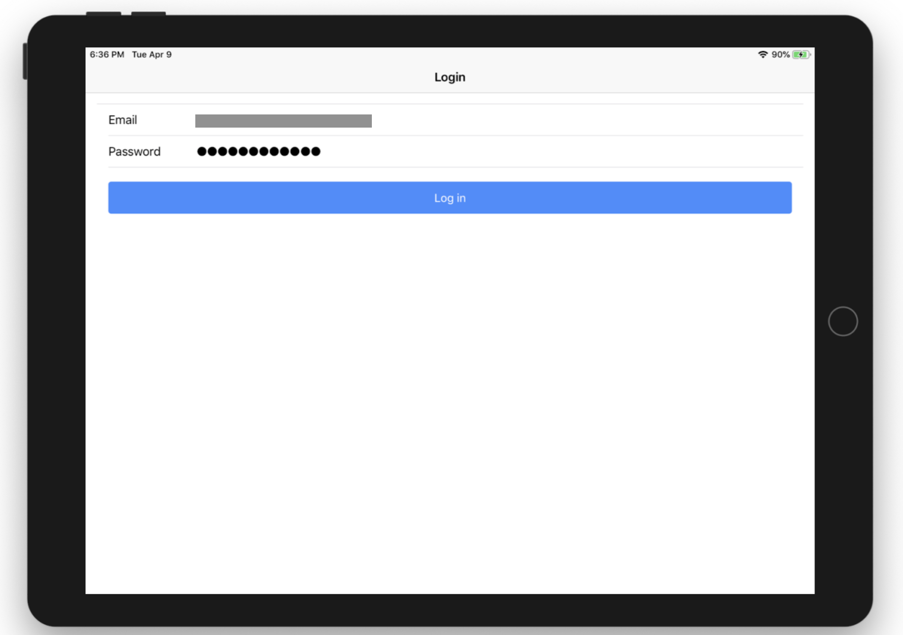
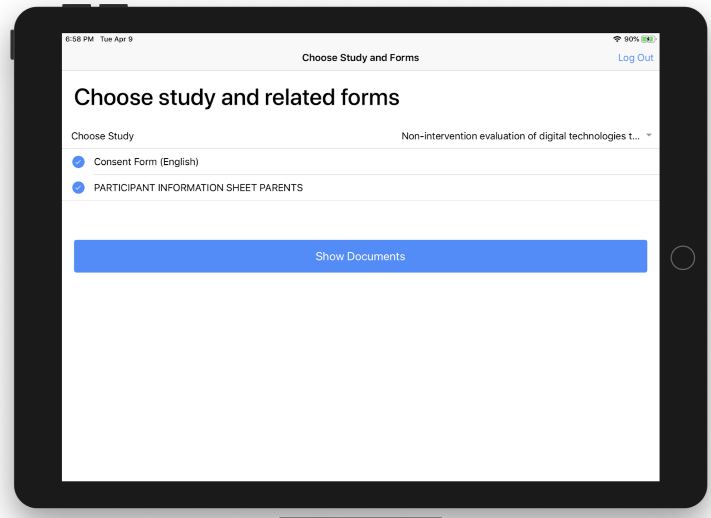
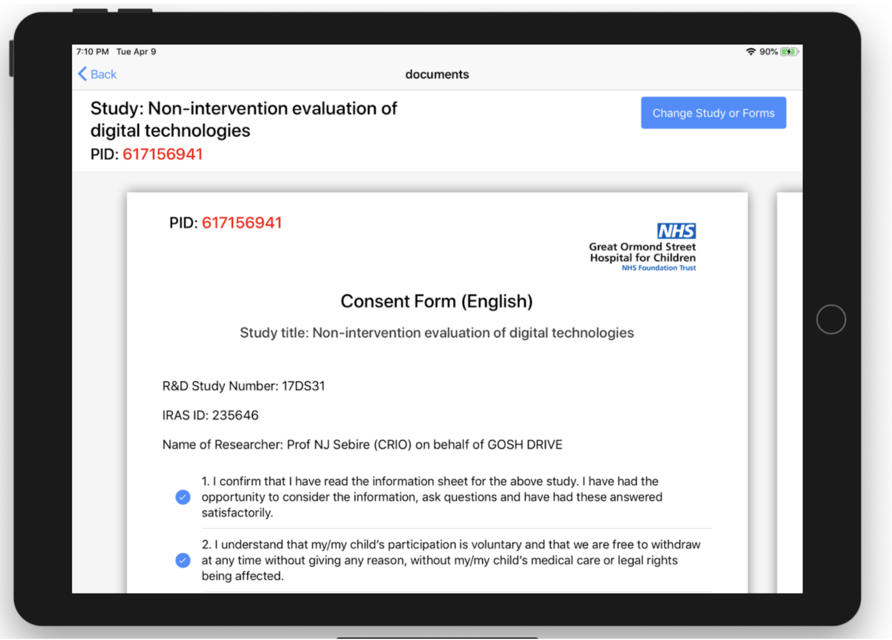
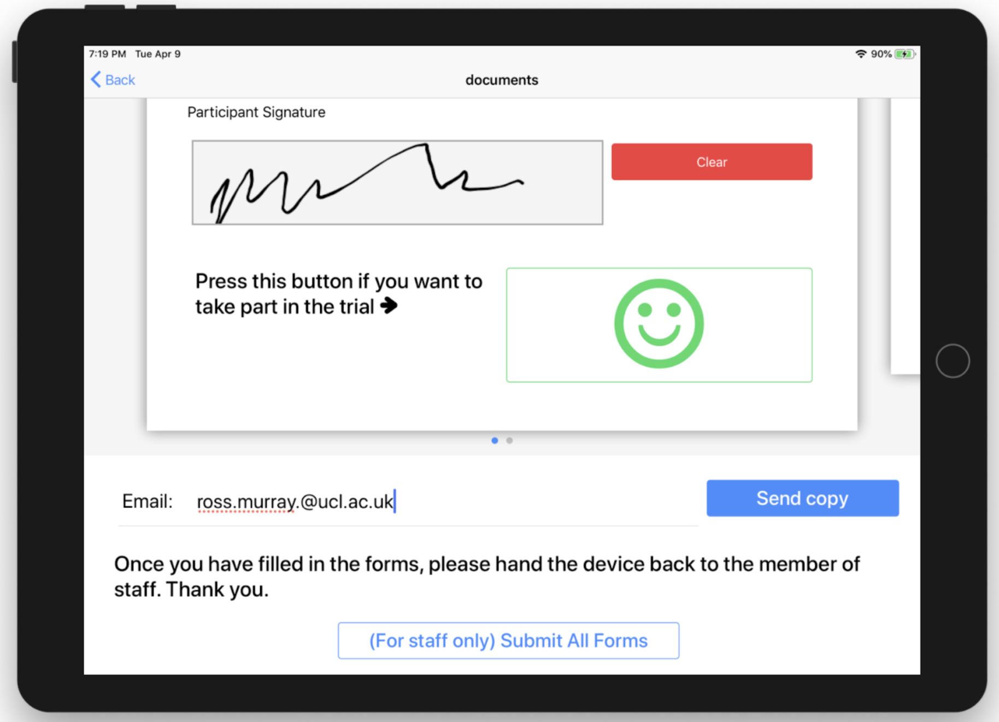

# Informed Consent Cross-Platform App

This project created a hybrid app for Android/ iOS built using Angular + Ionic. The app allows forms to be shown to and filled out by the end-user and sent to the backend via a REST API.

Login page: 

Choose forms: 

Fill in consent forms:

## To run in the browser:

    npm run start